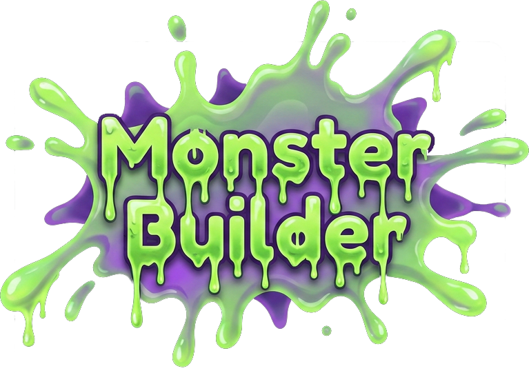

<div align="center">



---

### 🎤 Scan dit ansigt · Brøl i 5 sekunder · Født et monster
### 🎤 Scan your face · Scream for 5 seconds · Birth a monster

[](https://monster-builder-larssolo.vercel.app)
&nbsp;
[](https://monster-builder-larssolo.vercel.app)
&nbsp;
[](https://monster-builder-larssolo.vercel.app)

</div>

---

## 🎮 Sådan spiller du / How to play

<div align="center">

| | DA | EN |
|:--:|:--|:--|
| **1** | Klik på Monster Builder–logoet | Click the Monster Builder logo |
| **2** | Hold dit ansigt stille mens det scannes | Hold your face still while it's scanned |
| **3** | **RÅB · SKRIG · BRØL** i 5 sekunder 🔊 | **ROAR · SCREAM · ROAR** for 5 seconds 🔊 |
| **4** | Se dit monster blive født med et glitch-reveal 👹 | Watch your monster be born with a glitch-reveal 👹 |
| **5** | Sig **MONSTER!** for at spille igen | Say **MONSTER!** to play again |

</div>

---

## 👾 Mød monsterkassen / Meet the monster roster

```
  BLOB              FLERHOVEDET         BLÆKSPRUTTE
  ╭━━━━━╮           ╭╮   ╭╮             ╭━━━━━╮
  │ ◉ ◉ │          (◉) (◉)(◉)          │ ◉ ◉ │
  │  ▽  │           ╰━━━━━╯            ╰━━━━━╯
  ╰~~~~~╯          ╭━━━━━━━╮         ∫∫∫│││∫∫∫
  ░░░░░░░░         │ ▽▽▽▽▽ │          ∫∫∫∫∫∫∫∫

  ALIEN             DRAGE               ØJE-MONSTER
   ∧___∧           ╱▔▔╲╱▔▔╲            ╭━━━━━╮
  (⊙   ⊙)        ╱  ◉  ◉  ╲         ╭──│◎◎◎◎│──╮
   ╰━▽━╯        ╱____________╲        ╰──╰━━━━╯──╯
   ╱┃┃┃╲        ▓▓▓▓▓▓▓▓▓▓▓▓▓       ░░░░░░░░░░░░
```

**18 unikke arketyper:** Blob · Flerhovedet · Blæksprutte · Bæst · Fisk · Fugl · Orm · Alien · Krabbe · Drage · Øjemonster · Gelé · Virus · Bakterie · Slange · Skorpion · Dino · Amøbe

---

## ✨ Features

- 🎭 **Ansigt → Monster** — MediaPipe scanner dit ansigts form og bruger det som DNA til monsteret
- 🔊 **Lyd → Personlighed** — Din stemmes styrke, tonehøjde og rytme former monsterets udseende
- 🌍 **Dansk + Engelsk** — Registrerer automatisk dit sprogs og skifter — eller tryk 🌍
- 👆 **Ét klik** — Tryk på logoet, resten sker af sig selv
- 🔒 **100% privat** — Ingen data forlader din browser. Nogensinde.
- 📱 **Ingen installation** — Åbn i Chrome/Edge og spil

---

## 🛠 Teknik

| Komponent | Teknologi |
|:--|:--|
| Ansigts-scan | MediaPipe FaceLandmarker (on-device WASM) |
| Lyd-analyse | Web Audio API (RMS · spectral centroid · onsets) |
| Stemme-genkendelse | Web Speech API (`da-DK` / `en-US`) |
| Monster-tegning | HTML Canvas 2D + goo-filter (`blur + contrast`) |
| Reveal-effekt | SVG conic-gradient + CSS glitch-animation |
| Hover-effekter | 3 tilfældige: slime-wobble · elektrisk glitch · monster-puls |
| Deploy | GitHub → Vercel (auto) |
| Afhængigheder | **Ingen** — én HTML + én JS-fil |

---

## 🔒 Privatliv / Privacy

> **DA:** Alt afvikles i din browser. Hverken billede eller lyd gemmes eller sendes — kun geometriske mål bruges (ansigtets form, lydens styrke og tonehøjde). Ingen ansigtsgenkendelse, ingen følelsesaflæsning.
>
> **EN:** Everything runs in your browser. No image or audio is stored or transmitted — only geometric measurements are used (face shape, volume and pitch). No facial recognition, no emotion detection.

---

## 🚀 Kør lokalt / Run locally

```bash
git clone https://github.com/larssolo/Monster-Builder.git
cd Monster-Builder
python3 -m http.server 8000
# Åbn http://localhost:8000 i Chrome
```

> Kræver **Chrome** eller **Edge** (Web Speech API virker ikke i Firefox/Safari)

---

## 📁 Projektstruktur

```
Monster-Builder/
├── index.html                 ← HTML + CSS (layout, animationer, fonte)
├── app.js                     ← Alt JavaScript (logik, canvas, tale, lyd)
├── monster-builder-splash.png ← Splash-logo med slime-effekt
├── monster.png                ← Favicon
└── README.md
```

---

<div align="center">

Lavet med 👹 brøl og ❤️ kærlighed

**[larssolo](https://github.com/larssolo)** · Powered by MediaPipe + Web APIs + Canvas

</div>
